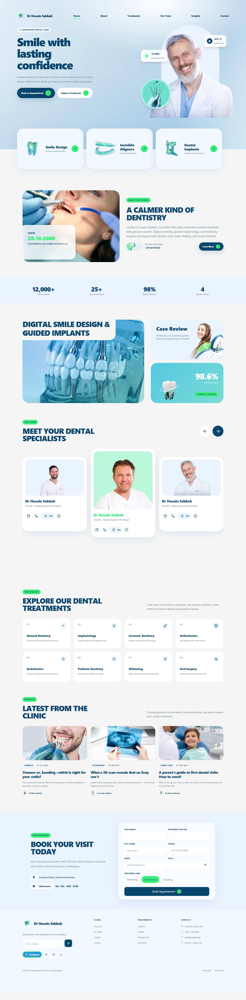

<div align="center">

# Dr Husain Sabbah Dental Clinic

<p><strong>A polished, responsive clinic website prototype for modern dental care in Dubai.</strong></p>

<p>
  
  
  
</p>

<a href="#quick-start">Quick start</a>&nbsp;&nbsp;•&nbsp;&nbsp;
<a href="#experience">Experience</a>&nbsp;&nbsp;•&nbsp;&nbsp;
<a href="#project-structure">Structure</a>

</div>

---

<div align="center">
  
</div>

## Experience

<table>
  <tr>
    <td width="33%" valign="top">
      <h3>🦷 Calm, confident care</h3>
      <p>A reassuring editorial design that introduces the clinic, its philosophy, and its credentials with clarity.</p>
    </td>
    <td width="33%" valign="top">
      <h3>✨ Treatment discovery</h3>
      <p>Easy-to-scan paths for preventative, restorative, cosmetic, orthodontic, and specialist treatments.</p>
    </td>
    <td width="33%" valign="top">
      <h3>📅 Appointment ready</h3>
      <p>A streamlined booking form lets visitors share treatment needs, preferred doctor, date, and time.</p>
    </td>
  </tr>
</table>

### Designed around trust

| | What visitors see |
| :-- | :-- |
| **Hero** | Clear value proposition, proof points, and direct appointment CTA |
| **Clinic story** | A welcoming introduction backed by outcomes and experience |
| **Digital dentistry** | Smile design and guided-implant capabilities presented visually |
| **Specialist team** | A responsive, one-card-at-a-time carousel with usable actions |
| **Treatments & insights** | Quick navigation plus patient-friendly educational content |
| **Contact** | Location, opening hours, social links, and newsletter signup |

## Quick start

```bash
npm install
npm run dev
```

Open the local URL shown by Vite to explore the prototype.

### Verify a production build

```bash
npm run build
npm run test:sites
```

## Project structure

```text
src/
├── App.jsx          # Page content, sections, and interactions
├── main.jsx         # React entry point
└── styles.css       # Responsive visual system

public/assets/figma/ # Source imagery and interface assets
public/website-preview.png # Full-page visual preview
worker/              # Sites-compatible server entry point
tests/               # Sites build verification
```

## Technology

<p>
  
  
  
  
</p>

---

<div align="center">
  Built as a high-fidelity dental-clinic prototype with care, clarity, and conversion in mind.
</div>
